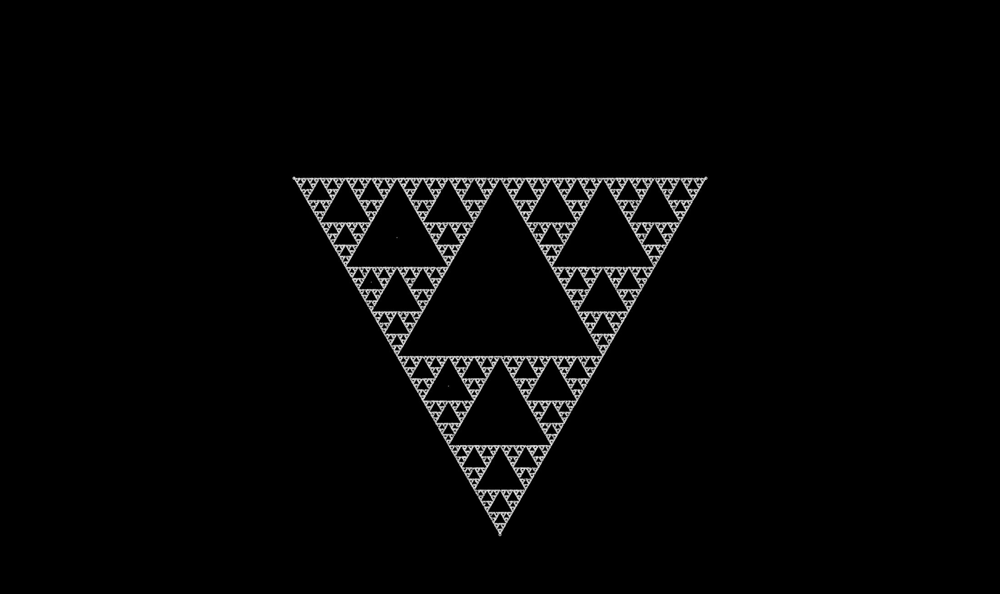
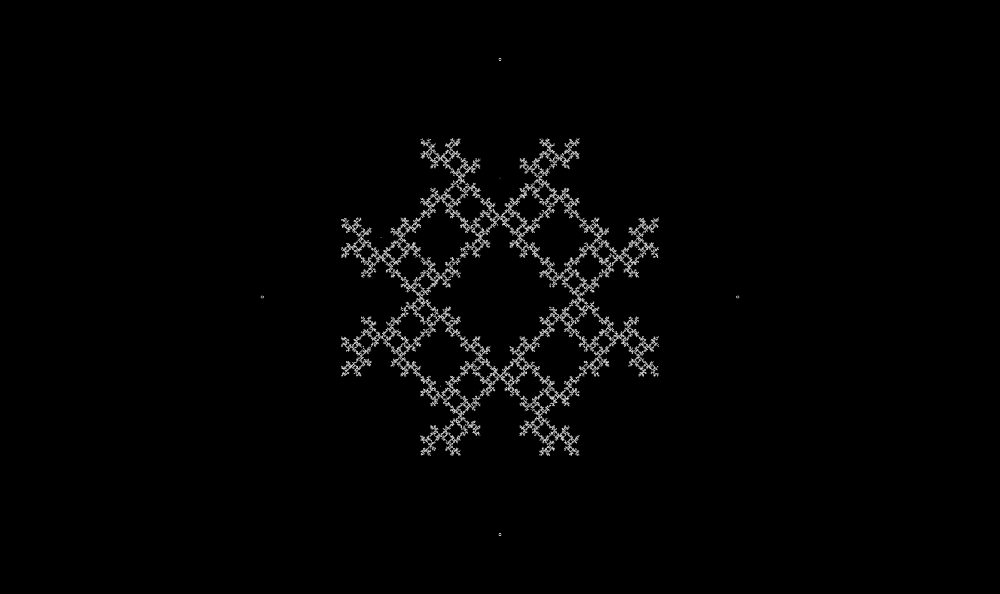
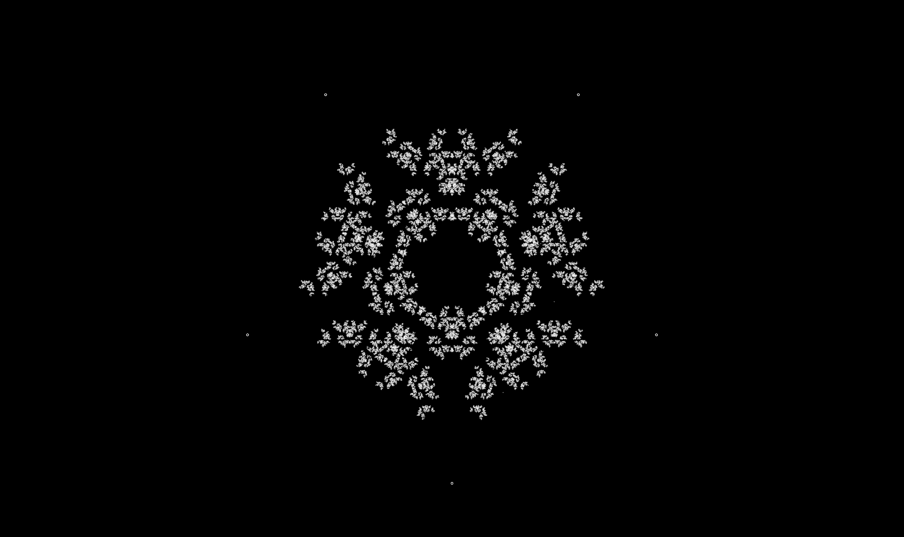

# Chaos game
A web based app reffering to method of creating fractal pattern, using a polygon and an initial point selected at random inside it. The fractal is created by iteratively creating a sequence of points, starting with the initial random point, in which each point in the sequence is a given fraction of the distance between the previous point and one of the vertices of the polygon; the vertex is chosen at random in each iteration.

### References
[App is inspired from Numberphile youtube video](https://www.youtube.com/watch?v=kbKtFN71Lfs)<br/>
[Also check wikipedia article to get more info on the subject](https://en.wikipedia.org/wiki/Chaos_game)<br/>


### Example output
<br/>
<br/>
<br/>

### Usage
1. Fork and install the App
2. Open js/app.js
3. Create instance of class and give parameters
Create global variable without defined value
```sh
  let chaosGame;
```
4. In `setup()` function create instance of object and set parameters
```sh
  chaosGame = new ChaosGame({
    polygonType: 4,     //default 3, min 3
    ruleType: 1,        //default 0, max 4
    showVertexes: false //default true
  });
```
5. In `draw()` function call method `chaosGame.move()`
6. Run index.html in your browser

### Dependencies
This app is using [P5.js library](https://github.com/processing/p5.js)
